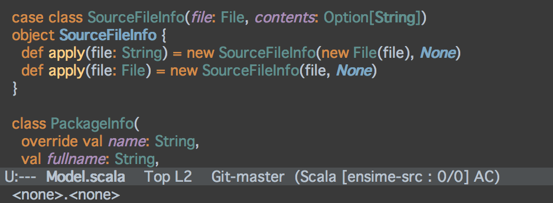
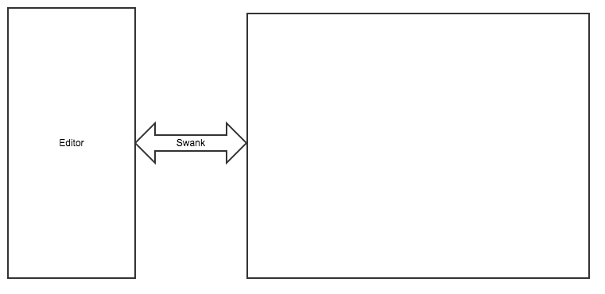
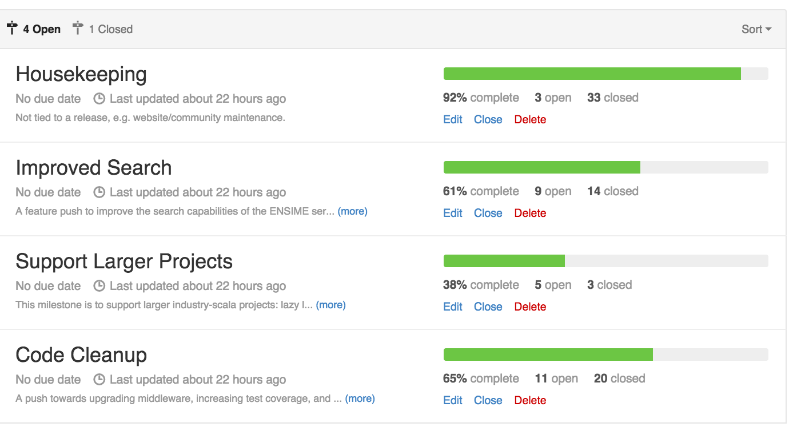
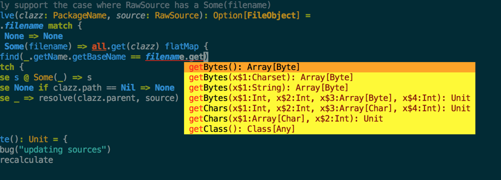

% Ensime - The other IDE
% Rory Graves
% Scala eXchange December 2014

# Introduction

------

## The elevator pitch

> * ENhanced Scala Interaction Mode for text Editors
> * Originally designed for Emacs
> * Its really an IDE server
> * All of the logic is behind a protocol
> * which leads to some interesting possibilities

- Poll of IDEs
- Confession - I don't actually use emacs

- Seperation of concerns between editor and IDE components

--------

## What I am not talking about

> * How to install Ensime
> * It is easy and well documented on the website

--------

## What I am going to talk about

> * A little bit of history
> * Cool features in Ensime
> * Ensime Development
> * Extending Ensime
> * Ensime as a library
> * The future

# A little bit of history

When I started thinking about this talk I emailed Aamon

--------

Started in early 2010 when Aemon (a seasoned elisper),
had a lightbulb moment with the presentation compiler

--------

It started as a hacked version of SLIME.

--------

Aemon was in the midst of his MSCS, applied for Google Summer of Code and was accepted
(mentored by Hubert Plociniczak from EPFL).

--------

Over GSOC added all of the key elements of a basic IDE (jump to definition, repl support, debug support, etc)

--------

*  Time passes - Aemon spoke at some conferences

--------

* Time passes - spare time hacking.

--------

* Replaced in memory index with lucene for huge speedup.

--------

* Redid debugger using jdi

--------

* More time passes

--------

* Experiment replacing lucene with graph DB - a failure.

--------

* Time passes, Aemon has a job, a baby and little time.

--------

## Present

Aemon's words: ' A band of open source heroes appears...'

# Cool features in Ensime

--------

## Features 1: Editing

* Everything you would expect from Emacs
* Semantic highlighting
* Contextual completion
* Type under cursor
* Add an import for the symbol under the cursor.

--------

## Feature 2: Search and Navigation

* Fast classpath search (types and members)
* Jump to source code or documentation
* Browse packages and type hierarchies
* Jump to definition

--------

## Features 3: Refactoring

Uses the scala-refactoring library.

(also using by Scala-IDE (eclipse))

Supports basic refactorings:

* Rename
* Organise imports
* Extract variable
* Extract method

--------

## Features 4: Debugging

All of the features you would expect:

* Start/Attach to process
* Add/remove breakpoints
* Step
* Inspect values

--------

## Bonus features

- All of the goodies in Emacs e.g.

* Magit
* Using The real compiler
* So many plugins!
* e.g. UTF inline, text on disk
* Themes - Darcula theme

# Ensime development

--------

## Structure

TODO PIC OF BASIC STRUCTURE - front to back

--------

## Continuous release

> * Ensime has a rolling release.
> * Pushing to the mainline causes build and deploy.
> * This has a major impact on review and testing behaviour
> * High confidence means rapid fix and feature deployment

--------

## Ensime startup

> * Emacs plugin updated from Melpa
> * Plugin creates small sbt file
> * Emacs calls sbt file to bootstrap server
> * Emacs awaits port information
> * Emacs connects to server

--------

## CI - Jenkins

> * We ended up dropping Travis
> * Still a work in progress
> * Goal is to have full scala/emacs regression tests on all branches.

--------

## Testing and Coverage

> * We measure and care about coverage - current at 64%
> * Next PR will take this over 75%
> * Extending tests and coverage into Emacs
> * We use the awesome SCoverage (http://github.com/scoverage/scoverage) to track it.
> *   And fail the build if coverage drops.

--------

# Extending Ensime

> * We are working to make Ensime more extensible
> * Easier protocol creation/integration

--------

## Adding features

Three steps:

* Add appropriate protocol methods
* Implement the server component
* Add editor support

--------

## Adding new editors

* Still a bit rough right now.
* Protocol driven
* Hoping to get community support to re-enliven the older editor support.

* Building editor with Scala.js

# Ensime as a library

- Ensime as an analysis library
- Ask questions about the codebase
- Cool possibilities

# The Future

--------

## Short term (1)

--------

## Short term (2)

> - More tests
> - More test coverage (Thanks Scoverage!)
> - Make editor integration easier

--------

## Short term (3)

> - Automated Emacs tests
> -- Improved CI

--------

## Short term (4)

- Integration with Company mode for completion-at-point (Aemon WIP)

--------

## Short term goal

- A trusted, stable, base platform

--------

## Long term

> * More features!
> * More Editors!
> * Integration with other tooling - e.g. inline code coverage.

# In Conclusion

> * Still rough round the edges
> * A usable and improving alternative to Eclipse and IDEA
> * Flexible
> * Extensible
> * Easy to integrate into other editors
> * Opens up lots of fun possibilities

# Some thanks

This is a team effort

> * Aemon Cannon (@aemoncannon)
> * Eric Daniel (@edani)
> * Sam Halliday (@fommil)
> * Marc Saegesser (@marcsaegesser)
> * ...

# Thanks!

<h2>Questions?</h2>

http://github.com/ensime/ensime-server

@a_dev_musing
